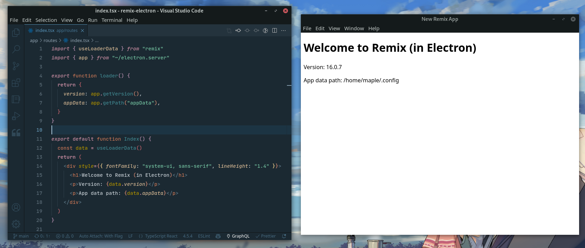

<p align="center"></p>
<p align="center">
  <a aria-label="NPM version" href="https://github.com/inperium-corp/remixtron/pkgs/npm/remixtron">
    
  </a>
  <a aria-label="NPM downloads" href="https://github.com/inperium-corp/remixtron/pkgs/npm/remixtron">
    
  </a>
  
</p>

Electron integration for Remix

## Support

### Remixtron vs Remix

| remixtron        | remix  |
| ---------------- | ------ |
| `v0.0.1.alpha.x` | `v1.x` |

### Package Manager

`npm`, `yarn` and `pnpm` are supported.

## Usage

### Create Application with Template

Use degit to create a new project from the template.

```
# with npx
$ npx degit @inperium-corp/remixtron/template MY_APP

# with yarn
$ yarn degit @inperium-corp/remixtron/template MY_APP

# with pnpx
$ pnpx degit @inperium-corp/remixtron/template MY_APP
```

### Adding to an existing Remix project

Add a file at `desktop/main.js` to run the electron app. The `initRemix` function returns a url to load in the browser window.

```ts
// desktop/main.js
const { initRemix } = require('remix-electron');
const { app, BrowserWindow } = require('electron');
const { join } = require('node:path');

let win;

app.on('ready', async () => {
  try {
    const url = await initRemix({
      serverBuild: join(__dirname, 'build')
    });

    win = new BrowserWindow({ show: false });
    await win.loadURL(url);
    win.show();
  } catch (error) {
    console.error(error);
  }
});
```

Update `serverBuildPath` in your Remix config:

```js
// remix.config.js
/**
 * @type {import('@remix-run/dev/config').AppConfig}
 */
module.exports = {
  serverBuildPath: 'desktop/build/index.js'
  // ...
};
```

Build the app with `npm run build`, then run `npx electron desktop/main.js` to start the app! 🚀

## Using Electron APIs

Importing `"electron"` directly in route files results in Electron trying to get bundled and called in the browser / renderer process.

To circumvent this, create a `electron.server.ts` file, which re-exports from electron. The `.server` suffix tells Remix to only load it in the main process. You should use `.server` for any code that runs in the main process and uses node/electron APIs.

```js
// app/electron.server.ts
// @ts-nocheck
import electron from "electron"
export = electron
```

Likewise, for any code running in the renderer process, e.g. using the [clipboard](https://www.electronjs.org/docs/latest/api/clipboard) module, you can use the `.client` suffix. Renderer process modules require `nodeIntegration`.

```js
// desktop/main.ts
function createWindow() {
  // ...
  win = new BrowserWindow({
    // ...
    webPreferences: {
      nodeIntegration: true
    }
  });
}
```

## API

### `async initRemix({ serverBuild[, publicFolder, mode, getLoadContext] })`

Initializes remix-electron. Returns a promise with a url to load in the browser window.

Options:

- `serverBuild`: The path to your server build (e.g. `path.join(__dirname, 'build')`), or the server build itself (e.g. required from `@remix-run/dev/server-build`). Updates on refresh are only supported when passing a path string.

- `mode`: The mode the app is running in. Can be `"development"` or `"production"`. Defaults to `"production"` when packaged, otherwise uses `process.env.NODE_ENV`.

- `publicFolder`: The folder where static assets are served from, including your browser build. Defaults to `"public"`. Non-relative paths are resolved relative to `app.getAppPath()`.

- `getLoadContext`: Use this to inject some value into all of your remix loaders, e.g. an API client. The loaders receive it as `context`

<details>
<summary>Load context TS example</summary>

**app/context.ts**

```ts
import type * as remix from '@remix-run/server-runtime';

// your context type
export type LoadContext = {
  secret: string;
};

// a custom data function args type to use for loaders/actions
export type DataFunctionArgs = Omit<remix.DataFunctionArgs, 'context'> & {
  context: LoadContext;
};
```

**desktop/main.js**

```ts
const url = await initRemix({
  // ...

  /** @type {import("~/context").LoadContext} */
  getLoadContext: () => ({
    secret: '123'
  })
});
```

In a route file:

```ts
import type { DataFunctionArgs, LoadContext } from '~/context';

export async function loader({ context }: DataFunctionArgs) {
  // do something with context
}
```

</details>

## Credits

This project is a fork of the [remix-electron])(https://github.com/itsMapleLeaf/remix-electron/tree/main/src).
Credits to to @itsMapleLeaf the author.

## License

This project is licensed under the terms of the [MIT license](https://github.com/inperium-corp/remixtron/blob/main/LICENSE).
